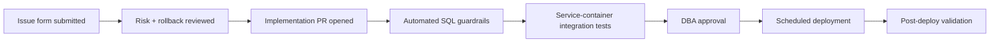

# DBA Change Control Flow

```mermaid
flowchart LR
    A[Issue form submitted] --> B[Risk + rollback reviewed]
    B --> C[Implementation PR opened]
    C --> D[Automated SQL guardrails]
    D --> E[Service-container integration tests]
    E --> F[DBA approval]
    F --> G[Scheduled deployment]
    G --> H[Post-deploy validation]
```
